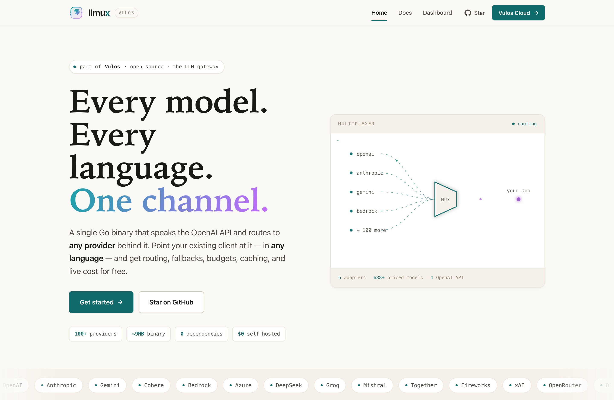
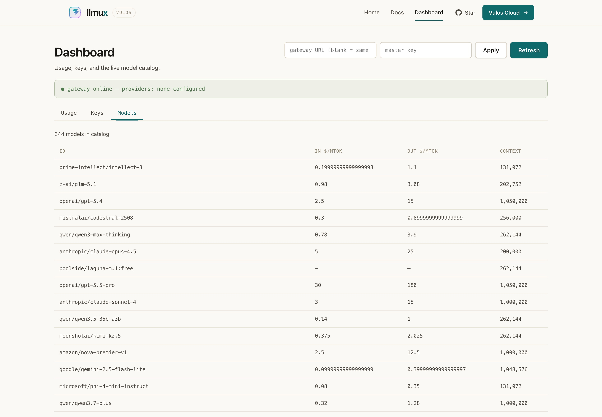
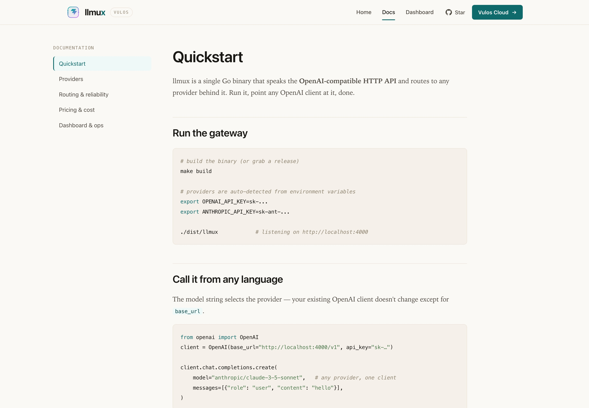

<div align="center">


# llmux

**The Vulos LLM gateway — one OpenAI-compatible endpoint for every provider, in every language.**

[](LICENSE)
[](PARITY.md)
[](https://github.com/vul-os/llmux/actions)
[](TESTING.md)
[](https://golang.org)
[](https://react.dev)

*Vulos — rooted in **vula**, the Zulu and Xhosa word for **open**.*

<sub>Part of the <strong><a href="https://vulos.org">Vulos</a></strong> OS suite — alongside <a href="https://github.com/vul-os/vulos-office">Office</a> &amp; <a href="https://github.com/vul-os/vulos-mail">Mail</a></sub>



</div>

---

## Overview

llmux is a single Go binary that speaks the **OpenAI-compatible HTTP API** and routes to any LLM provider behind it. Because every language already ships a mature OpenAI client that accepts a custom `base_url`, llmux works in **every language on day one with zero per-language code** — point your existing OpenAI SDK at llmux and get routing, fallbacks, budgets, caching, and live cost underneath.

It carries the Vulos spirit — self-hosted, open source, no telemetry, no lock-in — into the LLM layer: a control plane you run, not a service you rent.

```text
  any-language app ──(OpenAI SDK, base_url = llmux)──▶  ┌─────────┐ ──▶ OpenAI
                                                        │         │ ──▶ Anthropic
                                                        │  llmux  │ ──▶ Gemini · Cohere · Bedrock · Azure
                                                        │   mux   │ ──▶ DeepSeek · Groq · xAI · Mistral …
                                                        └─────────┘ ──▶ 100+ via passthrough
```

> *"Vula" — open the door. llmux opens it to every model.*

---

## Screenshots

| Dashboard | Docs |
|-----------|------|
|  |  |

A web dashboard **and** rendered docs ship **inside the binary** at `/ui` (embedded via `go:embed`) — usage by model, virtual-key budgets, and the live price catalog. No separate service to run.

---

## Quick start

```bash
make build
export OPENAI_API_KEY=...        # providers auto-detected from env
export ANTHROPIC_API_KEY=...
./dist/llmux                     # gateway on :4000  (dashboard at /ui)
```

Point **any** OpenAI client at it — the model string selects the provider:

```python
from openai import OpenAI
client = OpenAI(base_url="http://localhost:4000/v1", api_key="x")

client.chat.completions.create(
    model="anthropic/claude-3-5-sonnet",   # any provider, one client
    messages=[{"role": "user", "content": "hi"}],
)
```

### Or embed it locally — no server to run

Each language package bundles the binary and starts it as a local sidecar (Go runs it in-process):

```python
import llmux
client = llmux.OpenAI()                     # spawns the gateway, returns an OpenAI client
client.chat.completions.create(model="gemini-1.5-pro", messages=[...])
```

```js
const llmux = require("llmux");
const client = await llmux.OpenAI();
await client.chat.completions.create({ model: "gpt-4o", messages: [...] });
```

```go
local, _ := llmux.Start(llmux.Options{})    // in-process, no subprocess
defer local.Close()
// point any OpenAI Go client at local.OpenAIBaseURL()
```

See [`sdks/`](sdks/) for details.

> **Codebase rule:** the web app uses `.jsx` only — never `.tsx`.

---

## Features

| Area | What you get |
|------|--------------|
| **Any language** | OpenAI-compatible REST + **byte-identical** SSE; works with every OpenAI SDK unchanged |
| **Providers** | Passthrough (OpenAI, DeepSeek, Groq, Mistral, Together, Fireworks, xAI, OpenRouter, Ollama/vLLM) + native adapters (Anthropic, Gemini, Cohere, AWS Bedrock, Azure OpenAI) with tool-calling, vision & streaming translation |
| **Routing** | Aliases, `provider/model` prefix, **prefix wildcards** (`claude-*`), catch-all, fallback chains, retries, and **least-cost** selection |
| **Live cost** | Price catalog auto-synced from OpenRouter + LiteLLM; **micro-dollar** accounting; cost in every response `usage` block; `/v1/models` from the catalog |
| **Governance** | Virtual keys with per-key budgets, rate limits, and model allow-lists; spend in Postgres, limits in Redis |
| **Caching** | Exact-match (LRU + TTL) **and** semantic (embedding-similarity); in-memory or shared via Redis |
| **Hardening** | Cancellation, upstream timeouts, body limits, rate-limit header relay, OpenAI-canonical error normalization, `drop_params` |
| **Single binary** | Go embeds the entire web UI — one file to deploy. Prometheus `/metrics`, structured logs, health check, Docker |

---

## Where llmux fits

Honest positioning. llmux is best-in-class for **self-hosted, single-binary** deployments and is engineered for correctness — but it is younger than the incumbents on breadth and battle-testing, and we say so.

| Capability | llmux | LiteLLM | OpenRouter |
|---|:---:|:---:|:---:|
| Single binary, no runtime | ✅ one Go binary | ❌ Python app | — hosted SaaS |
| Drop-in OpenAI API, any language | ✅ | ✅ proxy | ✅ API |
| Self-host, bring your own keys | ✅ | ✅ | ❌ |
| Routing + fallback + least-cost | ✅ | ✅ | ◑ auto only |
| Exact + semantic caching | ✅ | ✅ | ❌ |
| Live cost in every response | ✅ | ◑ | ✅ |
| Provider breadth | ◑ 6 + passthrough | ✅ 100+ | ✅ 300+ |
| Battle-tested maturity | ◑ new | ✅ | ✅ |

> ✅ yes · ◑ partial · ❌ no. Adapters ship **beta/experimental** until verified against live provider APIs — see [PARITY.md](PARITY.md).

---

## Why gateway-first

LiteLLM is **library-first** (a Python SDK), which structurally traps it in Python. llmux is **gateway-first**: the OpenAI HTTP schema is the canonical interface, providers are adapters behind it, and the language ecosystems already wrote the clients. We write the gateway once; you get every language free.

Three rules keep "any language" true as features grow:

1. The OpenAI HTTP schema is the canonical contract — provider quirks never leak.
2. Routing / budget controls ride on standard fields + `extra_headers` / `metadata` — no custom client is ever needed.
3. Streaming is **byte-identical** to OpenAI SSE — every language's stream parser just works.

---

## Pricing catalog — free, live, and route-correct

A seed ships built-in so cost works offline. At runtime llmux auto-syncs from pluggable **sources** and merges them by **precedence** so cost is correct per route:

```text
override (manual pin) > provider pricing API > LiteLLM (direct) > OpenRouter (margin) > built-in seed
```

- **Route-aware:** a call routed *through* OpenRouter is costed at its margin-inclusive price; a **direct** BYO-key call prefers the authoritative direct price.
- **Manual overrides** (inline or hot-reloaded JSON) always win.
- **Open export:** `GET /v1/catalog.json` republishes the merged catalog.

---

## Architecture

```text
core/                MIT — the open gateway
  openai/            canonical wire types (the contract)
  server/            HTTP gateway, streaming, auth, metrics, usage
  provider/          Provider interface + SSE utils
    passthrough/     OpenAI-shaped upstreams
    anthropic/ gemini/ cohere/ bedrock/ azure/   native adapters
  router/            routing + least-cost
  keys/              virtual keys, budgets, rate limits
  cache/             exact + semantic response cache
  pricing/           catalog + live sync + cost
cmd/llmux/           the binary (server + local sidecar)
web/                 Vite + React UI (Vulos design system, embedded at /ui)
sdks/                thin language packages (python, node, go)
ee/                  enterprise/cloud (open-core)
```

The **same binary** is both the hosted server and the locally-embedded sidecar — one codebase, two distribution modes.

---

## Development

```bash
make build      # build the binary
make web        # rebuild the embedded web UI
make test       # all Go tests (-race)
make docker     # build the Docker image
```

---

## License

[MIT](LICENSE) — free to use, modify, and distribute. The whole project is open source under MIT; monetization is **[Vulos Cloud](https://vulos.org)**, not a different code license.

---

<div align="center">

Made with care · Powered by open source · *Vula — open*

</div>
